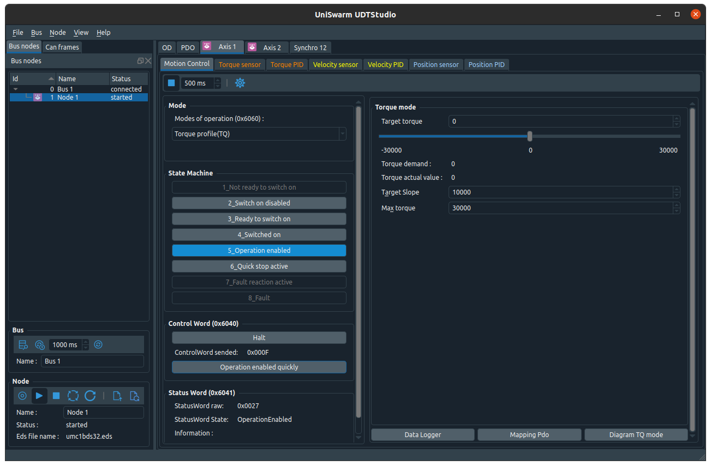
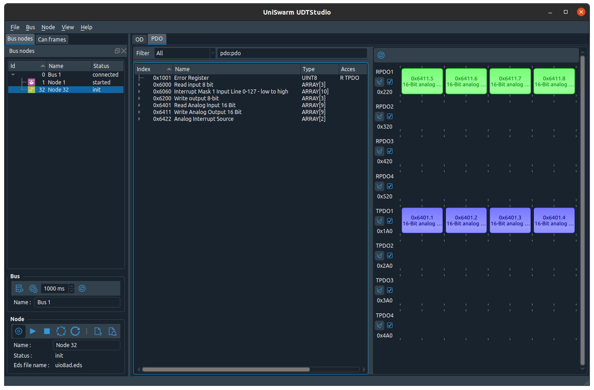

# UDTStudio

[](http://www.gnu.org/licenses/gpl-3.0)
[](https://travis-ci.org/UniSwarm/UDTStudio)
[](https://ci.appveyor.com/project/sebcaux/udevkit-ide)

CANOpen tools for UniSwarm products.





## dependencies
### Qt > 5.9

Qt module used :

- core
- gui
- widgets
- charts

## QT5 for UDTStudio : charts

```
sudo apt install git make g++ qtbase5-dev libqt5charts5-dev
```

## Build

Do not forget to init and update submodule before build ore clone recursively.

```
git clone https://github.com/UniSwarm/UDTStudio.git --recursive
cd UDTStudio
mkdir build
cd build
qmake ../src
make -j`nproc`
```

Binaries will be placed in `bin/` directory.

## EDS files

UDTStudio use an environment variable `EDS_PATH` to read EDS files :

`export EDS_PATH="pathToEdsRepertory"`

You can permanently set it by pushing it to your ~/.profile file.

A directory is provided with eds files of all UniSwarm products.
